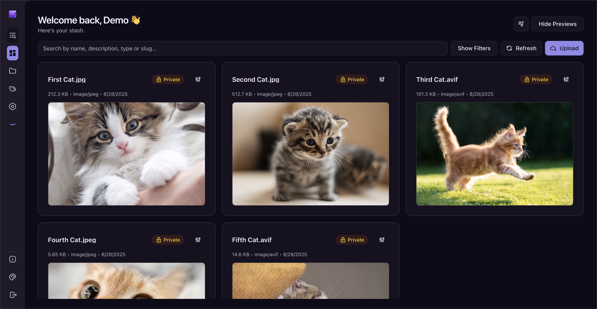
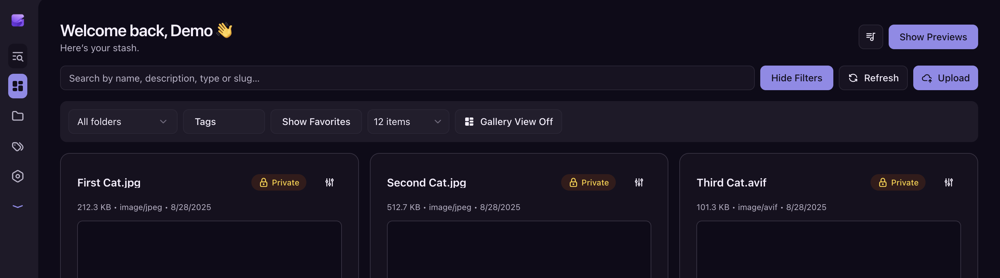
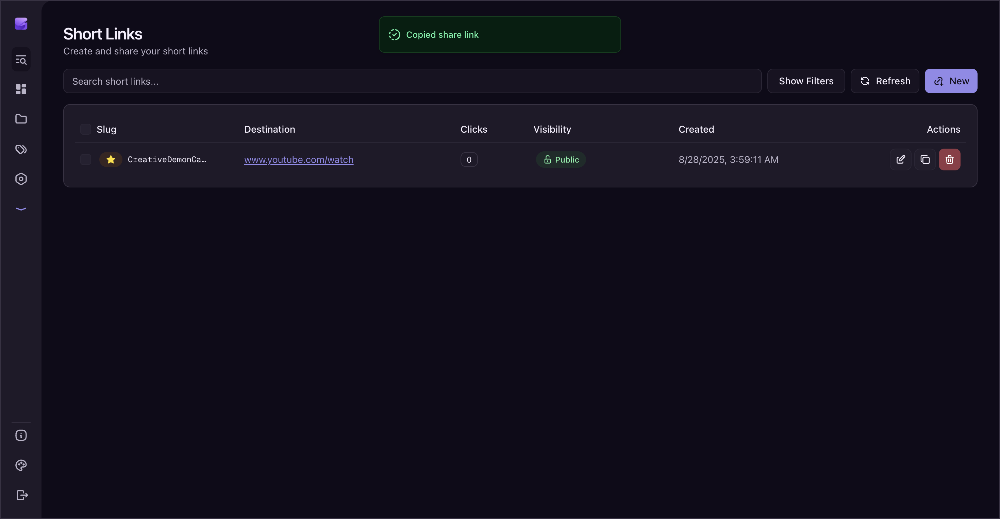
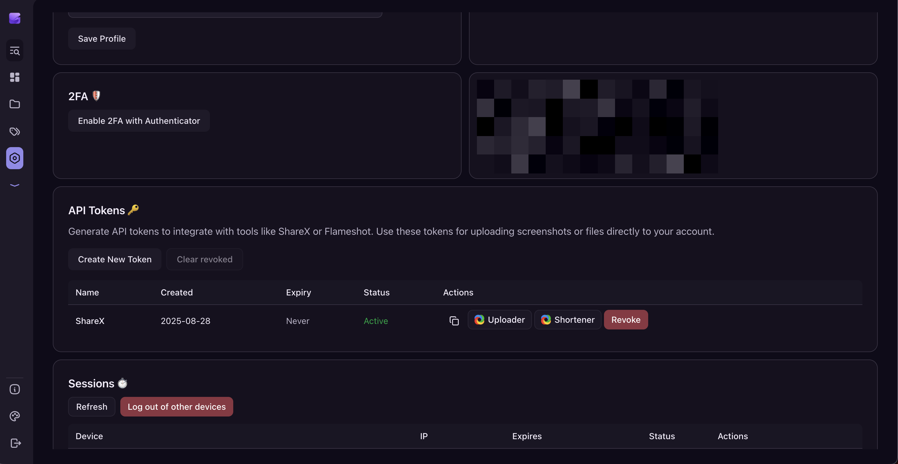

# Swush

Swush is a secure, self-hosted full‑stack file manager and personal dashboard built with Next.js, TypeScript, TailwindCSS, and Lucia authentication. It offers a unified platform to manage your bookmarks, notes, snippets, recipes, watchlist (anime, movies, TV shows), games collection, and more; all with privacy and control in mind.

> [!NOTE]
> This project is currently in active development and may have breaking changes in the future.
> Additionally, please note that the following features are exclusive to the Pro Version:
> - Bookmarks: Save and organize your favorite links.
> - Snippets: Store and manage your code snippets with ease.
> - Recipes: Keep track of your favorite recipes and cooking tips.
> - Notes: Create and organize your personal notes.
> - Integrations and many other features...

## ✨ Features

### Authentication & Security
- Email/password login with optional 2FA (TOTP).
- Robust session management.
- Role-based access control with Owner, Admin, and User roles.
- Admin capabilities to promote/demote users and protect API endpoints.

### Content Management Modules
- Files, Shorten Links, (PRO Exclusive - Bookmarks, Snippets, Recipes, Notes)
- Pagination, bulk selection and deletion.
- Slug support for friendly URLs.

### Watchlist (PRO Exclusive)
- Track movies, TV shows, and anime via TMDB & AniList integrations. (Integrations are solely per the session, no user data is saved, but the selected data is retained.)
- Season and episode progress tracking.
- Adding personal notes.
- Bulk actions (delete, change visibility).
- Public sharing via `/l/username` with optional privacy toggle for each show.
- Import data from AniList.

### Games Collection (PRO Exclusive)
- Add games manually or import from Steam.
- Track status: playing, completed, backlog, dropped.
- Bulk actions and pagination.
- Adding personal notes.
- Public sharing via `/g/username` with optional privacy toggle for each game.

### UI/UX
- Responsive design powered by Tailwind CSS v4.
- Smooth animations and transitions.
- Image paste-to-upload functionality.

### Infrastructure & Integrations
- Minimal API routes abstracted into reusable `lib/` functions.
- Email notifications for password resets, new logins, and import summaries.
- Docker support for streamlined production deployment.


## 📦 Tech Stack
- **Frontend:** Next.js, React, TailwindCSS
- **Backend:** Next.js API routes, TypeScript, Lucia (authentication)
- **Database:** PostgreSQL (Neon or self-hosted)
- **ORM:** Drizzle
- **External APIs:** TMDB, AniList, Steam, RAWG
- **Email:** SMTP (configurable)


## 🚀 Getting Started

### 1. Clone the repository
```bash
bun x degit sleepyico/swush
cd swush
```

### 2. Install dependencies
```bash
bun install
```

### 3. Setup environment variables
Copy `example.env` to `.env` and update the values:
```bash
cp example.env .env
```

### 4. Environment Variables Overview

#### Core
- `NODE_ENV` — Application environment.
- `AUTH_SECRET` — Secret key used for authentication.
- `UPLOAD_ROOT` — Root directory for file uploads.
- `CORS_ORIGINS` — Comma-separated list of allowed CORS origins.
- `ENABLE_FUNNY_SLUGS` — Enable generation of funny slugs (e.g., YodaCrazyFalconRider) instead of random strings.

- `NEXT_PUBLIC_APP_NAME` — Name of your application.
- `NEXT_PUBLIC_APP_URL` — Base URL of your app.

- `NEXT_PUBLIC_SUPPORT_NAME` — Support name.
- `NEXT_PUBLIC_SUPPORT_EMAIL` — Support email address.

#### SMTP / Email
- `SMTP_HOST` — Hostname of the SMTP server.
- `SMTP_USER` — Username for SMTP authentication.
- `SMTP_PASS` — Password for SMTP authentication.
- `SMTP_PORT` — Port for the SMTP server.
- `SMTP_FROM` — Email address displayed as the sender.

- `DISABLE_LIMITS_EMAILS` — Disable email limits.

#### Usernames
- `PRESERVED_USERNAMES` — Comma-separated list of reserved usernames that cannot be registered.


### 5. Run database migrations
```bash
bun x drizzle-kit push
```

### 6. Start the development server
```bash
bun dev
```

Open [http://localhost:3000](http://localhost:3000) in your browser.


## 🐳 Deployment with Docker

### Build and run with remote database (Neon, Supabase, etc.)
```bash
docker compose up -d --build
```

### Run with self-hosted PostgreSQL
```bash
docker compose -f docker-compose.yml -f docker-compose.postgres.yml up -d --build
```

- The app will be accessible at [http://localhost:3000](http://localhost:3000).
- PostgreSQL will be exposed on port `5432` (credentials configured in `.env`).


## 🔧 Self‑Hosting Guide

1. **DNS & Reverse Proxy**
   - Point your domain to your server's IP.
   - Use a reverse proxy like Nginx, Traefik, or Caddy with HTTPS enabled (Let's Encrypt recommended).

2. **Environment Variables**
   - Set `NEXT_PUBLIC_APP_URL` to your domain with HTTPS.
   - Securely configure `AUTH_SECRET` and database credentials.

3. **Database**
   - Choose Neon (managed) or self-hosted PostgreSQL.
   - Regularly back up your database.

4. **Email**
   - Configure SMTP settings for password resets and notifications.


## 📸 Screenshots

You can manage your files, folders, tags and short links from the dashboard.


You can filter your files by type, tags, folder, and other criteria.


You can create and manage short links from the shortener page.


You can check your logged in sessions, manage your password, username, and api tokens. (Working with ShareX 100%)


## 🌐 Demo

Experience Swush live at [https://demo.swush.app](https://demo.swush.app).

You can log in with the following demo credentials:

- username: demo
- password: demo1234

Feel free to explore the features and get a feel for the app before deploying your own instance.


## 🤝 Contributing

Contributions are welcome! To contribute:

- Fork the repository.
- Create a feature branch.
- Open a pull request.

Before committing, run linting and tests:

```bash
bun lint
```


## 📜 License

APACHE 2.0 © 2025 Iconical (sleepyico)


## 💬 Support

- X: [x.com/sleepyiconical](https://x.com/sleepyiconical)
- Website: [iconical.dev](https://iconical.dev)
- GitHub: [sleepyico](https://github.com/sleepyico)
- Email: help+swush@iconical.dev